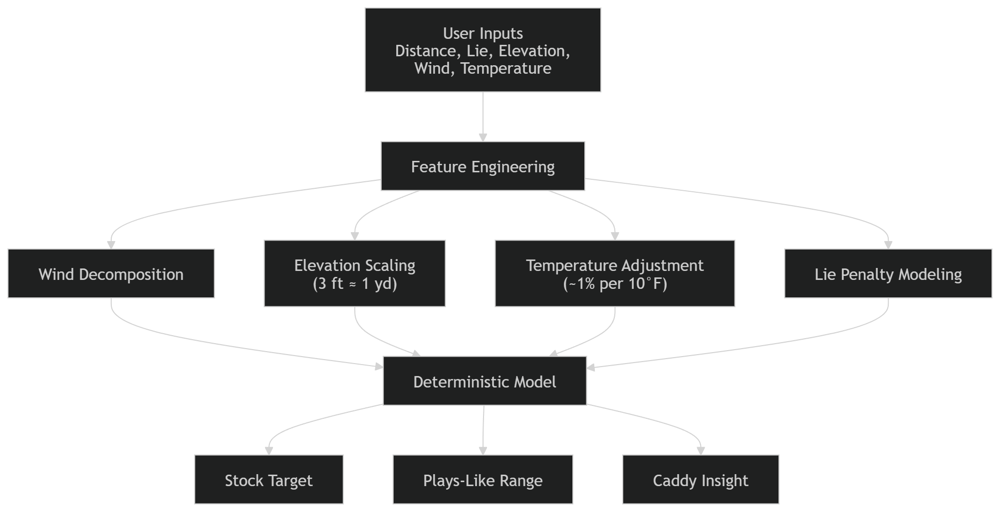
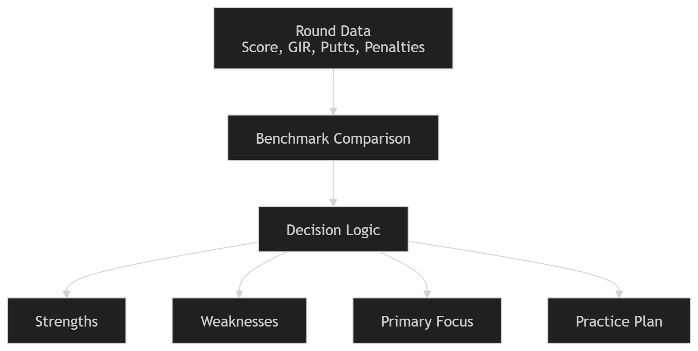

# MyCaddy: Golf Decision & Coaching System

**Author:** Palmer Projects  
**Version:** v2.1.1  
**License:** © Palmer Projects. All rights reserved.

---

# Case Study: Data-Driven Golf Decision & Coaching System

MyCaddy is an applied data science and decision systems project designed to model real-world golf conditions and convert them into **interpretable, high-confidence decision outputs**.

The system answers two core questions:

1. *What does this shot actually play like?*  
2. *What did this round reveal about my game?*  

---

# Problem

Golf decision-making and improvement suffer from two key limitations:

### 1. In-Round Decisions
Players rely on:
- static yardage
- feel-based adjustments
- inconsistent environmental interpretation  

This leads to:
- miscalculated distances  
- poor club selection  
- inconsistent outcomes  

---

### 2. Post-Round Analysis

Most players lack:
- structured evaluation frameworks  
- benchmark comparisons  
- actionable feedback loops  

This results in:
- repeated mistakes  
- inefficient practice  
- no clear improvement path  

---

# Solution

MyCaddy addresses both problems through a **dual-system architecture**:

- **MyCaddy:** Real-time deterministic modeling engine  
- **MyCoach:** Post-round analytics and decision system  

This separation ensures:

- fast, low-friction decision-making during play  
- structured, high-signal feedback after play  

---

# System Architecture

### MyCaddy (In-Round Decision Engine)

*Real-time decision engine transforming environmental inputs into a precise, playable carry distance.*

---

### MyCoach (Post-Round Analysis Engine)

*Post-round analytics engine converting performance data into structured insights and targeted improvement plans.*

---

# Data Science Approach

## Feature Engineering

Key variables were engineered to represent real-world conditions:

- Wind (vector decomposition)  
- Elevation (continuous scaling)  
- Lie (nonlinear penalty modeling)  
- Temperature (air density proxy)  

---

## Modeling Strategy

The system uses a **deterministic modeling pipeline**:

Input Features → Adjustment Functions → Aggregated Output  

Techniques include:

- Linear approximations (elevation)  
- Trigonometric decomposition (wind)  
- Nonlinear scaling (lie penalties)  
- Proportional modeling (temperature)  
- Constraint-based logic for stability  

---

## Analytics Framework

Performance is evaluated against external benchmarks:

- PGA Tour Top 10  
- PGA Tour Top 50  
- PGA Tour Average  

Metrics are classified using a **gap-based severity model**:

- Strength  
- Small Gap  
- Moderate Gap  
- Major Gap  

---

## Decision System Design

The MyCoach engine implements a rule-based system:

- Weakness ranking based on:
  - severity  
  - scoring impact  
  - contextual inputs  

- Focus determination:
  - single focus  
  - dual focus  

- Constraint rules:
  - prevent over-coaching  
  - ensure actionable outputs  

---

# Outputs

The system produces structured, interpretable outputs:

### MyCaddy
- Stock Target (primary decision variable)  
- Plays-Like Range (uncertainty band)  
- Caddy Insight (explanation layer)  

---

### MyCoach
- Strengths  
- Ranked weaknesses  
- Primary focus areas  
- Practice plan with targeted drills  

---

# Technology Stack

Python · Flask · Data Modeling · Feature Engineering · EDA · Statistical Analysis · Rule-Based Systems · HTML/CSS

---

# Results

- ±2–5 yard expected accuracy under realistic conditions  
- Stable outputs across environmental scenarios  
- Fully interpretable (no black-box modeling)  
- Direct mapping: data → decision → action  

---

# Impact

This project demonstrates the ability to:

- Translate real-world physical variables into structured data models  
- Design end-to-end data pipelines  
- Build interpretable decision systems  
- Apply analytics to solve real-world performance problems  

---

# Product Overview

MyCaddy is designed for:

- Amateur golfers  
- Competitive players  
- Data-driven athletes  

The system mirrors how high-level players operate:

> Make better decisions during the round  
> Learn from the round afterward  

---

# Roadmap

- Player-specific calibration  
- Shot dispersion modeling  
- Multi-round tracking  
- Expanded analytics capabilities  

---

# Disclaimer

- Estimates carry distance only  
- Does not model rollout  
- Does not recommend clubs  

---

# Summary

MyCaddy is a **data-driven decision and coaching system** that combines:

- physics-based modeling  
- structured analytics  
- real-world decision logic  

It bridges:

> execution during the round  
> improvement after the round  
